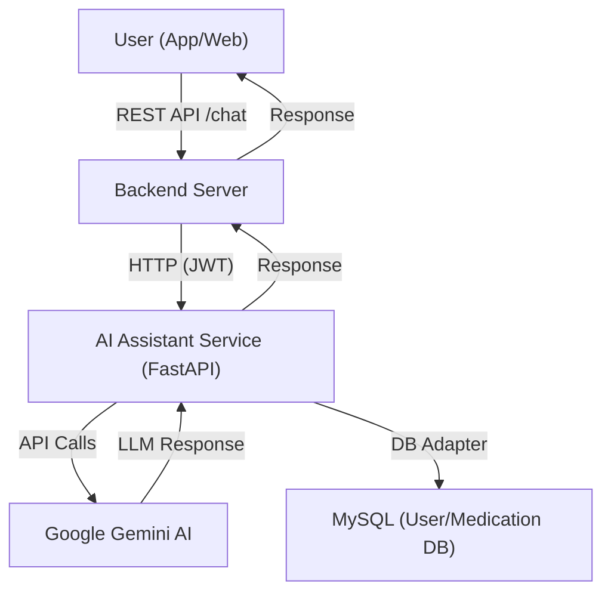
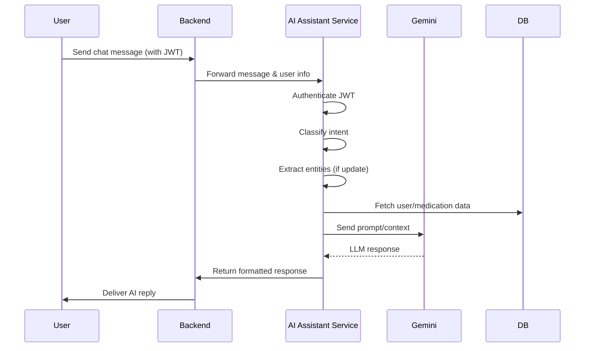
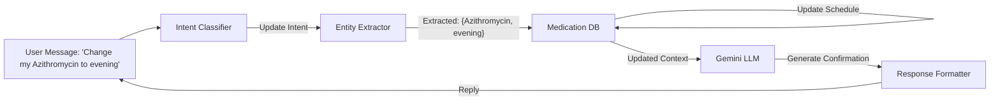

# AI Assistant Service Documentation

## Overview
The AI Assistant Service is an AI-powered microservice that provides intelligent healthcare assistance to users through natural language conversations. It processes user queries and medication schedule update requests using intent classification and entity extraction, providing personalized responses leveraging Google's Gemini AI model.

## Technology Stack
- **Language**: Python
- **AI Model**: Google Gemini 2.0 Flash
- **Framework**: FastAPI
- **Authentication**: JWT-based
- **Database**: MySQL (via custom DB adapter)

## Dependencies
- **fastapi**: API framework
- **pydantic**: Data validation and settings management
- **langchain**: Framework for LLM application building
- **langchain_google_genai**: Google Gemini integration with LangChain
- **google-generativeai**: Google Gemini AI API client
- **uvicorn**: ASGI server for FastAPI

---

# 🖥️ System Architecture (AI Assistant Service)



**Explanation:**
- The user interacts with the app, which sends chat requests to the backend.
- The backend forwards these to the AI Assistant Service, which authenticates, processes, and routes the request.
- The service may query the database for user/medication context and calls Gemini AI for LLM responses.
- The response is returned to the user via the backend.

---

# 🔄 Chat Flow Sequence



**Explanation:**
- The service authenticates the user, classifies the message intent, extracts entities if needed, fetches context, and queries Gemini AI for a response.
- The result is formatted and returned to the user.

---

# 🗂️ Medication Update Data Flow



**Explanation:**
- For update requests, the service extracts medicine and timing, updates the DB, and confirms via LLM.

---

# 🧭 Integration Points
- **Backend:** Receives and forwards user chat, handles authentication.
- **Gemini AI:** Provides LLM responses for chat and confirmations.
- **Database:** Stores and retrieves user medication data for context and updates.

---

## Key Components

### FastAPI Server
- Exposes RESTful endpoints for chat functionality
- Authenticates requests using JWT tokens
- Processes natural language queries

### Intent Classification System
- Identifies user intent (Query vs. Update)
- Routes requests to appropriate processing pipeline
- Provides fallback responses for ambiguous intents

### Entity Extraction Engine
- Extracts key entities from user messages:
  - Medicine names
  - Time periods
  - Actions (take, change, update)
  - Specific timings

### Gemini AI Integration
- Generates natural, contextual responses to user queries
- Maintains conversational context
- Supports multilingual interactions (English, Hindi, and Hinglish)

### Data Flow
1. User sends a message to the backend
2. Backend forwards the request to the AI Assistant Service
3. Service authenticates the user
4. Service classifies the message intent
5. For Query intent: Service retrieves user data and generates contextual response
6. For Update intent: Service extracts entities and updates medication schedule
7. Service returns formatted response to the backend
8. Backend delivers response to the user

## Key Functions

### `chat_endpoint(request, current_user)`
Main endpoint that handles all chat interactions:
1. Authenticates the user
2. Classifies the intent of the message
3. Routes to appropriate processing pipeline
4. Returns formatted response

### `classify_intent(message)`
Determines whether a user message is a query or a schedule update request.

### `extract_entities(message)`
Extracts relevant entities from update requests including medicine name, action, period, and timing.

### `create_user_direct_chain(user_id)`
Creates a personalized LangChain pipeline for a specific user:
1. Retrieves user-specific medication data
2. Formats data as context for the LLM
3. Creates a prompt template with user guidelines
4. Configures the LLM with appropriate parameters
5. Returns a callable chain function

## Request/Response Schema

### Request Format
```json
{
  "message": "When should I take my Azithromycin?"
}
```

### Response Format
```json
{
  "response": "You need to take 1 pill of Azithromycin in the morning after breakfast."
}
```

## Medication Time Periods
- **Morning**: Between 5:00 AM and 12:00 PM
- **Afternoon**: Between 12:00 PM and 5:00 PM
- **Evening**: Between 5:00 PM and 9:00 PM
- **Night**: Between 9:00 PM and 5:00 AM

## Error Handling
- Authentication failures
- Intent classification errors
- Entity extraction failures
- Database query errors
- LLM response generation errors

## Setup & Running
1. Install dependencies:
   ```
   pip install -r requirements.txt
   ```

2. Create a `.env` file with:
   ```
   GEMINI_API_KEY=your_gemini_api_key
   DATABASE_URL=your_database_connection_string
   JWT_SECRET=your_jwt_secret
   ```

3. Run the service:
   ```
   python main.py
   ```

## Integration with Backend
The Backend connects to this service via HTTP at `http://localhost:8000/chat`. It forwards user messages and authentication information and receives formatted responses to display to the user.

## Multilingual Support
The service supports interactions in:
- English
- Hindi
- Hinglish (Hindi-English mix)

The response language matches the input language automatically.

## Notes for Developers
- Ensure Google Gemini API credentials are properly configured
- The service requires access to the user medication database
- Response times typically range from 0.5-2 seconds
- Error responses include descriptive messages for debugging