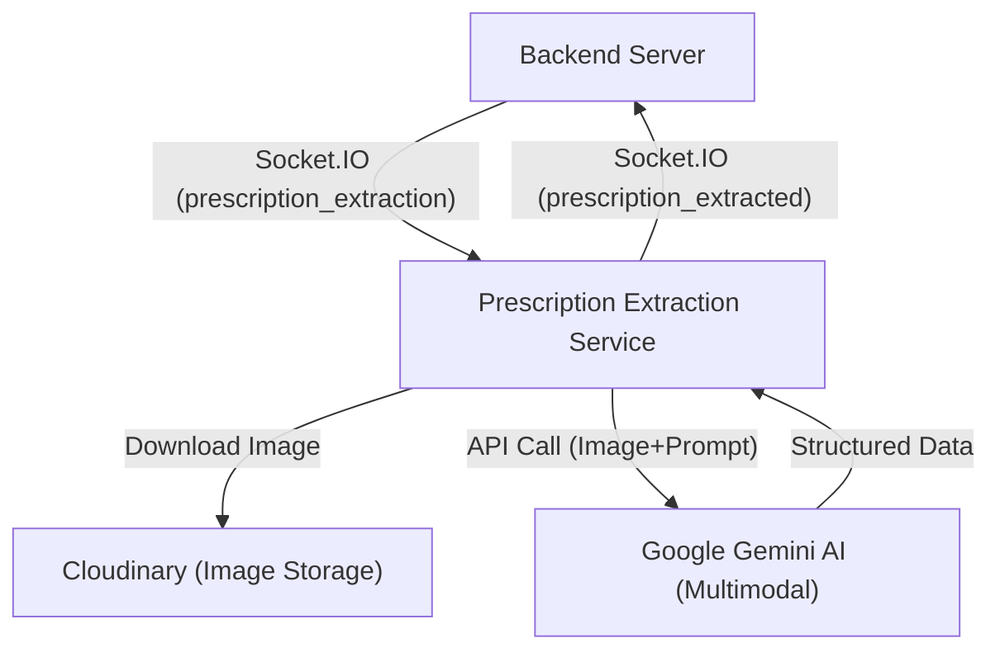
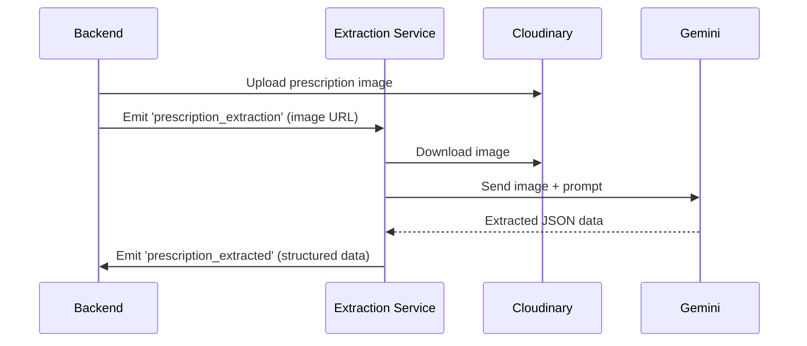
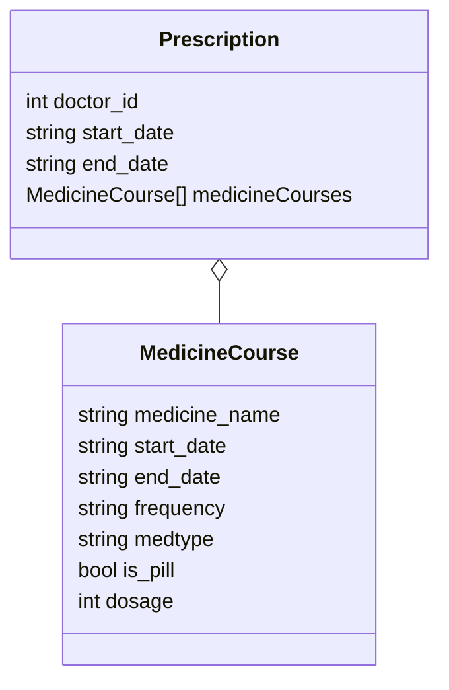

# Prescription Extraction Service Documentation

## Overview
The Prescription Extraction Service is an AI-powered microservice responsible for processing prescription images and extracting structured medication data. It acts as a bridge between the backend and Google's Gemini AI model, using Socket.IO for real-time communication.

## Technology Stack
- **Language**: Python
- **AI Model**: Google Gemini 2.0 Flash (Multimodal)
- **Communication Protocol**: Socket.IO
- **Server Framework**: Eventlet WSGI

## Dependencies
- **python-dotenv**: Environment variable management
- **requests**: HTTP client for downloading images
- **google-generativeai**: Google Gemini AI API client
- **python-socketio**: WebSocket server implementation
- **eventlet**: Concurrent networking library

## System Architecture
```
[Backend Server] <--Socket.IO--> [Prescription Extraction Service] <--API--> [Google Gemini AI]
```

## Key Components

### Socket.IO Server
- Listens on port 3002
- Handles real-time bidirectional communication with the backend
- Provides event-based architecture for processing prescription images

### Gemini AI Integration
- Uploads images to Google's Gemini AI model
- Processes multimodal content (images + text prompts)
- Extracts structured data from prescription images

### Data Flow
1. Backend uploads prescription image to Cloudinary
2. Backend sends Cloudinary URL to Prescription Extraction Service via Socket.IO
3. Service downloads image from Cloudinary
4. Service uploads image to Gemini AI with extraction prompt
5. Gemini AI extracts structured data from the image
6. Service parses and validates the AI response
7. Service sends structured data back to backend via Socket.IO

## Key Functions

### `download_image(image_url, save_path)`
Downloads an image from the given URL to the local filesystem.

### `upload_to_gemini(path, mime_type=None)`
Uploads an image to Google's Gemini AI for processing.

### `handle_prescription_extraction(sid, image_url)`
Main event handler that processes the prescription extraction request:
1. Downloads the image from the provided URL
2. Uploads it to Gemini AI
3. Processes the AI response
4. Returns structured medication data

## Data Schema
The service extracts and returns the following JSON structure:

```json
{
  "doctor_id": 1,
  "start_date": "YYYY-MM-DD",
  "end_date": "YYYY-MM-DD",
  "medicineCourses": [
    {
      "medicine_name": "MedicineName",
      "start_date": "YYYY-MM-DD",
      "end_date": "YYYY-MM-DD",
      "frequency": "1101",  // Binary representation of dosage times
      "medtype": "1",       // 0: before meals, 1: after meals, 2: anytime
      "is_pill": true,
      "dosage": 75
    },
    // Additional medicines...
  ]
}
```

## Frequency Encoding
The frequency field uses a 4-digit binary representation:
- First digit: Morning dose (0 or 1)
- Second digit: Afternoon dose (0 or 1)
- Third digit: Evening dose (0 or 1)
- Fourth digit: Night dose (0 or 1)

Example: "1101" means take the medicine in the morning, afternoon, and night, but not in the evening.

## Error Handling
- Connection errors with image download
- Upload failures to Gemini API
- AI response parsing errors
- JSON validation issues

## Setup & Running
1. Install dependencies:
   ```
   pip install -r requirements.txt
   ```

2. Create a `.env` file with:
   ```
   GEMINI_API_KEY=your_gemini_api_key
   ```

3. Run the service:
   ```
   python main.py
   ```

## Integration with Backend
The Backend connects to this service via Socket.IO at `http://localhost:3002`. It sends the Cloudinary URL of the uploaded prescription image in a 'prescription_extraction' event and listens for the 'prescription_extracted' event to receive the structured data.

## Notes for Developers
- Ensure Google Gemini API credentials are properly configured
- The service expects high-quality images of prescriptions
- Response times depend on Gemini API processing speed (typically 2-10 seconds)
- Error responses include descriptive messages for debugging 

---

# 🖥️ System Architecture (Prescription Extraction Service)



**Explanation:**
- The backend uploads prescription images to Cloudinary and notifies the extraction service via Socket.IO.
- The extraction service downloads the image, sends it to Gemini AI, and returns structured data to the backend.

---

# 🔄 Prescription Extraction Sequence



**Explanation:**
- The backend emits a Socket.IO event with the image URL.
- The extraction service downloads the image, sends it to Gemini, and emits the extracted data back.

---

# 🗂️ Extracted Data Schema



**Explanation:**
- The extracted data includes doctor ID, course dates, and a list of medicine courses with detailed fields.

---

# 🧭 Integration Points
- **Backend:** Sends image URLs and receives structured data via Socket.IO events.
- **Gemini AI:** Processes images and returns structured prescription data.
- **Cloudinary:** Stores prescription images for extraction.

--- 