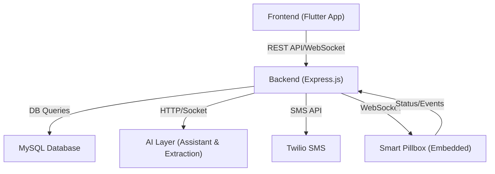
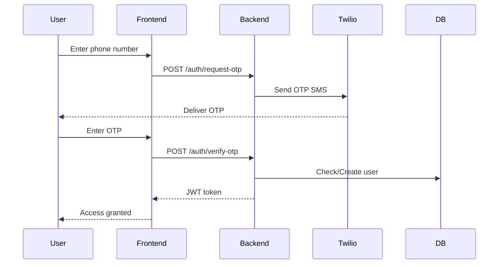
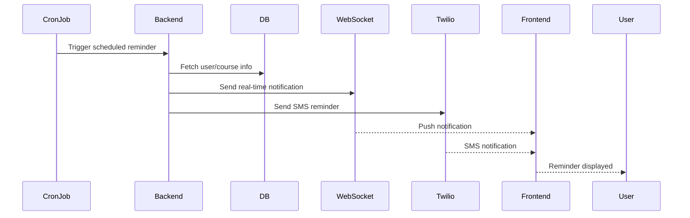
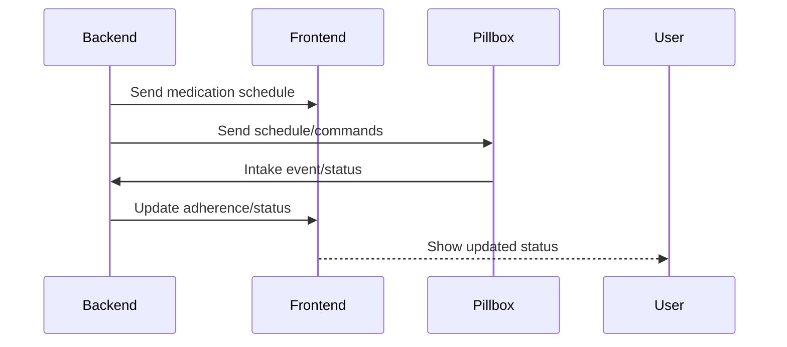

# Backend Documentation

## Overview
The Backend component provides a Node.js server application that serves API endpoints and WebSocket services for the healthmobi application. It handles user authentication, medication management, and real-time communication with the frontend and embedded devices.

## Technology Stack
- **Runtime Environment**: Node.js
- **Web Framework**: Express.js
- **Database**: MySQL (with mysql2 client)
- **Real-time Communication**: WebSockets
- **Scheduling**: Cron jobs for medication notifications
- **API Logging**: Morgan

## Project Structure
```
Backend/
├── controllers/     # Business logic controllers
├── cronJobs/        # Scheduled tasks
│   ├── medicineIntakeNotifier.js
│   └── quoteRefresher.js
├── middlewares/     # Express middlewares
├── routes/          # API route definitions
│   ├── authRoutes.js
│   ├── courseRoutes.js
│   ├── generalRoutes.js
│   ├── mediaRoutes.js
│   ├── specialRoutes.js
│   └── userFeaturesRoutes.js
├── db.js            # Database connection
├── main.sql         # Database schema
├── package.json     # Dependencies
├── server.js        # Main application entry
├── socket.js        # WebSocket implementation
└── twilio.js        # Twilio integration
```

## Key Components

### Express Server (server.js)
- Handles HTTP requests
- Serves API endpoints
- Serves static content from 'uploads' directory
- Initializes the WebSocket server

### Database (db.js, main.sql)
- MySQL database for data persistence
- Connection configured in db.js
- Schema defined in main.sql

### WebSocket Communication (socket.js)
- Real-time bidirectional communication
- Provides `broadcastMessage` function for sending messages
- Handles communication with frontend and embedded devices

### API Routes
- `/auth`: Authentication endpoints
- `/course`: Course-related endpoints
- `/general`: General application endpoints
- `/media`: Media handling endpoints
- `/special`: Special features endpoints
- `/user-feature`: User-specific feature endpoints

### Scheduled Tasks (cronJobs/)
- `medicineIntakeNotifier.js`: Sends medication reminders at scheduled times
- `quoteRefresher.js`: Updates motivational quotes

### External Services
- Twilio: SMS services integration (twilio.js)

## Environment Configuration
The application uses dotenv for environment configuration. Required environment variables:
- Database credentials
- Server port settings
- JWT secret (for authentication)
- Twilio credentials

## WebSocket Protocol
The WebSocket server handles real-time communication for medication reminders and compartment status updates. The server:
1. Sends medication schedules to devices
2. Receives compartment open/close status
3. Updates user profiles based on medication adherence

## Time Handling
The application uses moment-timezone with 'Asia/Kolkata' as the default timezone.

## Installation & Running
1. Install dependencies: `npm install`
2. Configure environment variables
3. Set up the database using `main.sql`
4. Start the server: `node server.js`

## Security Notes
- JWT used for authentication
- Body parsing with size limits
- Static routes for specific folders only 

---

# 🖥️ System Architecture (Backend)



**Explanation:**
- The backend acts as the central hub, connecting frontend, AI services, Twilio, the database, and embedded devices.

---

# 🔐 Authentication Flow



**Explanation:**
- The backend manages OTP-based authentication using Twilio and issues JWT tokens for secure access.

---

# ⏰ Medication Reminder & Notification Flow



**Explanation:**
- Cron jobs trigger reminders, which are sent via WebSocket (real-time) and Twilio (SMS) to users.

---

# 🔄 WebSocket Real-Time Flow



**Explanation:**
- The backend uses WebSocket to synchronize medication schedules and intake events between the app and the smart pillbox.

---

# 🧭 Integration Points
- **Frontend:** Consumes REST API and WebSocket for all user features.
- **AI Layer:** Receives chat and prescription extraction requests via HTTP/Socket.
- **Twilio:** Sends OTPs and reminders via SMS.
- **Embedded C (Pillbox):** Communicates via WebSocket for real-time medication tracking.
- **Database:** Stores all persistent data (users, courses, intakes, etc.).

--- 
